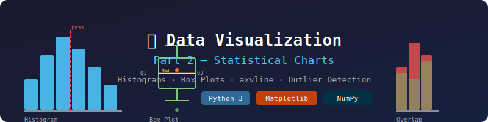

# 📊 Data Visualization — Part 2
### Histograms, Box Plots & Statistical Charts with Matplotlib




---

## 📌 Overview

This notebook dives deep into **statistical visualizations** using `matplotlib` and `numpy`. It covers two powerful chart types — **Histograms** and **Box Plots** — used to understand data distributions, detect outliers, and compare groups.

---

## 🖼️ Preview

```
Histogram                    Box Plot
  ██                         ┌────┐
  ██ ██                   ───┤    ├───
  ██ ██ ██               Min Q1  Q3 Max
  ██ ██ ██ ██               └────┘
 0  30  70  90  100         Median (Q2)
```

---

## 📂 Topics Covered

### 📊 1. Histograms

> A histogram groups continuous data into **bins** and shows frequency counts — perfect for visualizing distributions.

| Concept | Description |
|--------|-------------|
| `plt.hist()` | Core function to draw a histogram |
| `bins` | Control the grouping of data ranges |
| `color`, `edgecolor` | Style the bars |
| `alpha` | Transparency for overlapping datasets |
| `axvline` | Draw vertical reference lines (e.g., passing marks) |

#### 🔹 Examples in this Notebook:

- 📐 **Normal Distribution** of 100 student scores using `np.random.normal(70, 10, 100)`
- 🎓 **Student Marks Distribution** with custom bins `[0, 30, 70, 90, 100]`
- 💳 **Fraud vs Legit Transaction Detection** — overlapping histograms with `alpha=0.5`
- 📏 **Pass Mark Reference Line** using `axvline(x=33, linestyle="--", color="red")`

```python
# Overlapping histograms — fraud detection example
plt.hist(fraud_transactions, color="red", bins=20, label="Fraud", edgecolor="black")
plt.hist(legit_transactions, color="green", bins=20, label="Legit", alpha=0.5)
plt.title("Transaction Amount Distribution - Legit vs Fraud")
plt.legend()
```

---

### 📦 2. Box Plots (Whisker Plots)

> A box plot summarizes a dataset using **5 key statistics** — ideal for spotting outliers and comparing groups.

```
         ┌──────────────┐
  ───────┤   Q1    Q3   ├───────
  Min    └──────────────┘   Max
              │
           Median
```

| Statistic | Definition |
|-----------|-----------|
| **Q1** | 25th Percentile |
| **Q2 (Median)** | 50th Percentile |
| **Q3** | 75th Percentile |
| **IQR** | `Q3 − Q1` |
| **Outliers** | Values beyond `Q1 − 1.5×IQR` or `Q3 + 1.5×IQR` |

#### 🔹 Features Demonstrated:

| Feature | Parameter Used |
|--------|---------------|
| Multiple Datasets | Pass list of arrays: `[group1, group2]` |
| Horizontal Layout | `vert=False` |
| Show Mean | `showmeans=True` |
| Custom Whisker Length | `whis=2.0` |

```python
# Horizontal box plot comparing two class groups
plt.boxplot([classA, classB], tick_labels=["Class A", "Class B"], vert=False)
plt.title("Comparison of Students' Marks")
plt.grid(True)
```

---

## 🧰 Libraries Used

```python
import matplotlib.pyplot as plt
import numpy as np
```

| Library | Purpose |
|---------|---------|
| `matplotlib.pyplot` | Core plotting — histograms, box plots, lines |
| `numpy` | Data generation — `np.random.normal()`, `np.random.seed()` |

---

## 🚀 How to Run

```bash
# Install dependencies
pip install matplotlib numpy

# Launch notebook
jupyter notebook data_Visualization_part2_.ipynb
```

---

## 💡 Key Takeaways

| Chart | Best Used For |
|-------|--------------|
| 📊 Histogram | Frequency distribution of continuous data |
| 📦 Box Plot | Spread, median, and outlier detection |
| 📏 axvline | Marking thresholds or reference points |
| 🔀 Overlapping | Comparing two distributions visually |

---

> 📘 **Part of a multi-part Data Visualization series using Matplotlib & Python.**
