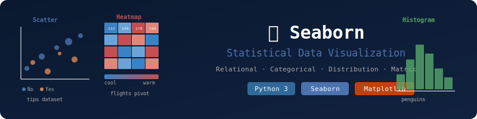

# 🌊 Seaborn — High-Level Statistical Visualization
### Relational, Categorical, Distribution & Matrix Plots




---

## 📌 Overview

**Seaborn** is a high-level Python data visualization library built on top of Matplotlib. While Matplotlib handles low-level control, Seaborn handles **high-level statistical plots** with beautiful defaults and direct support for Pandas DataFrames.

```
Matplotlib  →  Low-level, full control, verbose
Seaborn     →  High-level, statistical, concise ✨
```

---

## 🖼️ Plots at a Glance

```
 Scatter Plot         Heatmap              Box Plot
  ·  ·                ██ ░░ ▓▓            ┌────┐
·   ·  ·              ░░ ██ ░░        ────┤    ├────
  ·   ·               ▓▓ ░░ ██            └────┘
Total bill vs tip   Flights Passengers   Tips by Day
```

---

## 📂 Topics Covered

### 🔗 1. Getting Started

```python
import seaborn as sns
import matplotlib.pyplot as plt

sns.set_theme()              # Apply default Seaborn style
sns.get_dataset_names()      # View all built-in datasets
tips = sns.load_dataset("tips")  # Load the 'tips' dataset
```

#### 🔹 Built-in Datasets Used:
| Dataset | Description |
|---------|-------------|
| `tips` | Restaurant tips — total bill, tip, day, time, sex |
| `flights` | Monthly airline passenger counts (1949–1960) |
| `penguins` | Penguin body measurements by species |

---

### 📡 2. Relational Plots

> Show relationships between **two numeric variables**, optionally split by categories.

#### Line Plot
```python
sns.relplot(x=x_vals, y=y_sq, kind="line")

# Real dataset
sns.lineplot(data=flights, x="year", y="passengers")
```

#### Scatter Plot
```python
sns.scatterplot(data=tips, x="total_bill", y="tip", hue="time")
```

#### Advanced `relplot` — multiple visual encodings:
```python
sns.relplot(
    data=tips,
    x="total_bill", y="tip",
    hue="smoker",    # Color by category
    size="size",     # Marker size by group size
    style="smoker"   # Marker shape by category
)
```

| Parameter | Effect |
|-----------|--------|
| `hue` | Color-code by a category |
| `size` | Scale marker by a value |
| `style` | Different marker shapes per category |

---

### 📊 3. Categorical Plots

> Compare distributions or summaries **across categories**.

#### Bar Plot
```python
sns.barplot(data=tips, x="day", y="tip", hue="sex")
```

#### Box Plot
```python
sns.boxplot(data=tips, x="day", y="tip", hue="sex")
```

| Chart | Best For |
|-------|---------|
| `barplot` | Average value per category |
| `boxplot` | Distribution + outliers per category |

---

### 📉 4. Distribution Plots

> Understand the **shape and spread** of data.

#### Histogram
```python
penguins = sns.load_dataset("penguins")

sns.histplot(data=penguins, x="body_mass_g", bins=20)
```

Shows the frequency distribution of penguin body mass across 20 bins.

---

### 🗺️ 5. Matrix Plots (Heatmap)

> Visualize 2D tabular data as a **color-encoded matrix** — great for correlation, time-series patterns, and pivot tables.

```python
flights_data = flights.pivot(index="month", columns="year", values="passengers")

sns.heatmap(
    flights_data,
    cmap="coolwarm",   # Blue to red color scale
    annot=True,        # Show values inside cells
    fmt="d"            # Format as integers
)
plt.title("Passengers Heatmap")
```

The resulting heatmap shows **passenger growth from 1949 to 1960** — easy to spot seasonal trends and year-over-year increases.

---

### 🔧 6. Seaborn + Matplotlib Integration

> Seaborn works seamlessly with Matplotlib's OOP API for fine-grained control.

```python
fig, ax = plt.subplots()

sns.lineplot(
    data=tips, x="day", y="total_bill",
    hue="sex", marker="o",
    ax=ax,            # Attach to specific subplot
    errorbar=None     # Disable confidence interval
)
ax.set_title("Avg Bill Value for Each Day")
fig.tight_layout()
```

---

## 🧰 Libraries Used

```python
import seaborn as sns
import matplotlib.pyplot as plt
```

| Library | Role |
|---------|------|
| `seaborn` | High-level statistical charts |
| `matplotlib.pyplot` | Figure/axis control and fine-tuning |
| `pandas` | DataFrames (used internally by Seaborn) |

---

## 🚀 How to Run

```bash
# Install dependencies
pip install seaborn matplotlib pandas

# Launch notebook
jupyter notebook seaborn.ipynb
```

---

## 💡 Key Takeaways

| Plot Type | Function | Use Case |
|-----------|----------|---------|
| 🔵 Scatter | `sns.scatterplot()` | Relationship between 2 numeric vars |
| 📈 Line | `sns.lineplot()` | Trends over time |
| 📊 Bar | `sns.barplot()` | Category averages |
| 📦 Box | `sns.boxplot()` | Distribution + outliers by group |
| 📉 Histogram | `sns.histplot()` | Frequency distribution |
| 🌡️ Heatmap | `sns.heatmap()` | 2D matrix / correlation |
| 🕸️ Relplot | `sns.relplot()` | Multi-encoded scatter/line |

---

> 🌊 **Seaborn makes statistical visualization intuitive — great for EDA and data storytelling.**
