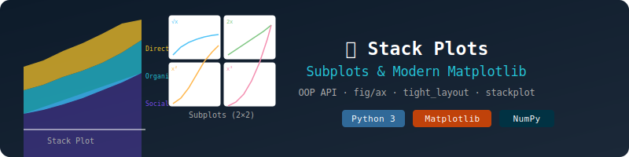

# 📈 Stack Plots, Subplots & Modern Matplotlib
### OOP API, Multi-Panel Figures & Stacked Area Charts




---

## 📌 Overview

This notebook covers **three powerful Matplotlib features** that help you build multi-layered and multi-panel visualizations:

1. 🗂️ **Stack Plots** — cumulative area charts
2. 🔲 **Subplots** — multiple charts in one figure
3. 🎯 **Modern OOP Matplotlib** — the `fig, ax` object-oriented approach

---

## 🖼️ Preview

```
Stack Plot              Subplots (2×2)
┌──────────────┐        ┌──────┬──────┐
│▓▓▓▓▓▓ Social │        │ √x   │  2x  │
│░░░░░░ Organic│        ├──────┼──────┤
│      Direct  │        │ x²   │  x³  │
└──────────────┘        └──────┴──────┘
 Mon Tue Wed Thu        Multi-panel figure
```

---

## 📂 Topics Covered

### 🗂️ 1. Stack Plots

> A **stackplot** layers multiple datasets on top of each other — great for showing cumulative totals and part-to-whole relationships over time.

```python
plt.stackplot(days, direct, organic, social,
              labels=["Direct", "Organic", "Social"])
plt.title("Marketing Data for the Week")
plt.legend()
```

#### 🔹 Use Case — Weekly Marketing Traffic:
| Source | Pattern |
|--------|---------|
| Direct | 50 → 110 (steady growth) |
| Organic | 30 → 80 (moderate growth) |
| Social | 20 → 60 (growing channel) |

Each area shows the **individual contribution**, and the top line is the **total traffic** across all channels.

---

### 🔲 2. Subplots

> `plt.subplot(rows, cols, index)` places multiple charts in a **grid layout** inside one figure.

```python
plt.subplot(2, 2, 1)   # Row 2, Col 2, Position 1
plt.plot(x, y1)
plt.title("Square Root")

plt.subplot(2, 2, 2)
plt.plot(x, y2)
plt.title("Double")

plt.tight_layout()     # Prevent overlap between plots
```

#### 🔹 Four Math Functions Plotted Side-by-Side:

| Panel | Function | Description |
|-------|----------|-------------|
| Plot 1 | `√x` | Square Root |
| Plot 2 | `2x` | Double |
| Plot 3 | `x²` | Square |
| Plot 4 | `x³` | Cube |

---

### 🎯 3. Modern Matplotlib — Object Oriented API

> The **OOP approach** (`fig, ax = plt.subplots()`) gives you full control over each subplot element — recommended for all production code.

```python
fig, ax = plt.subplots(2, 2, figsize=(5, 5))

ax[0][0].plot(x, y1)
ax[0][0].set_title("Square Root")
ax[0][0].set_xlabel("X-axis")
ax[0][0].set_ylabel("Y-axis")

fig.suptitle("Multiple Plots")
fig.tight_layout()
```

#### 🔄 Procedural vs OOP — Key Differences:

| Feature | Procedural (`plt.`) | OOP (`fig, ax`) |
|---------|---------------------|-----------------|
| Access plots | By position number | By index `ax[row][col]` |
| Titles | `plt.title()` | `ax.set_title()` |
| Labels | `plt.xlabel()` | `ax.set_xlabel()` |
| Overall title | Not clean | `fig.suptitle()` |
| Recommended for | Quick one-offs | Complex, reusable figures |

---

## 🧰 Libraries Used

```python
import matplotlib.pyplot as plt
import numpy as np
```

---

## 🚀 How to Run

```bash
# Install dependencies
pip install matplotlib numpy

# Launch notebook
jupyter notebook "stack_subplots__ModernMatplotlib.ipynb"
```

---

## 💡 Key Takeaways

| Topic | When to Use |
|-------|------------|
| 🗂️ Stack Plot | Show cumulative contribution of categories over time |
| 🔲 Subplots | Compare multiple plots side-by-side |
| 🎯 OOP API | Preferred for production — precise and reusable |
| `tight_layout()` | Always add to avoid overlapping axis labels |

---

> 📘 **Part of a multi-part Data Visualization series using Matplotlib & Python.**
