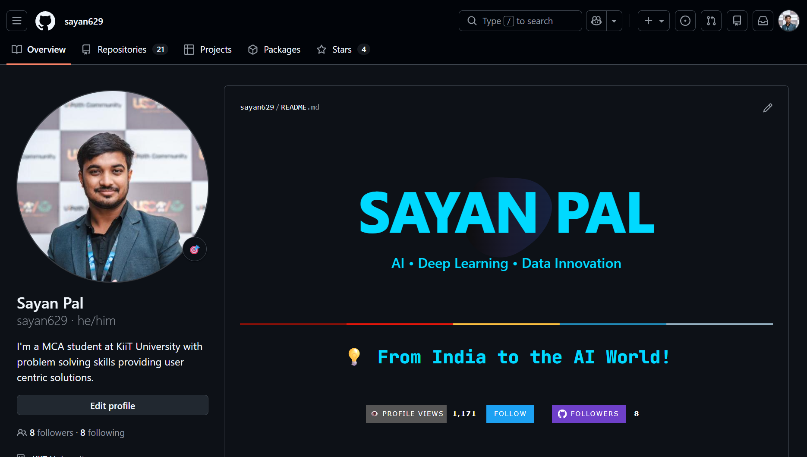
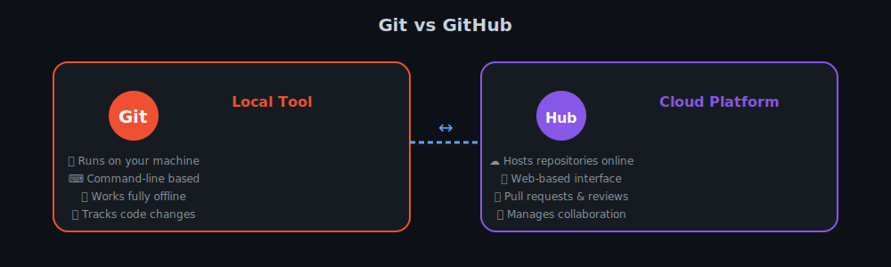
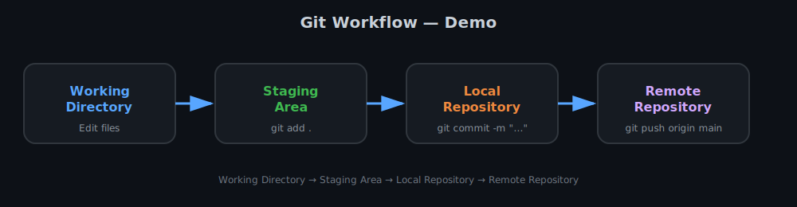
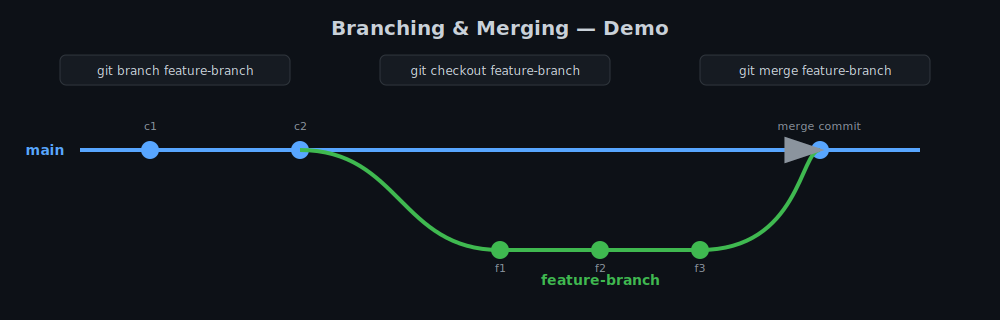
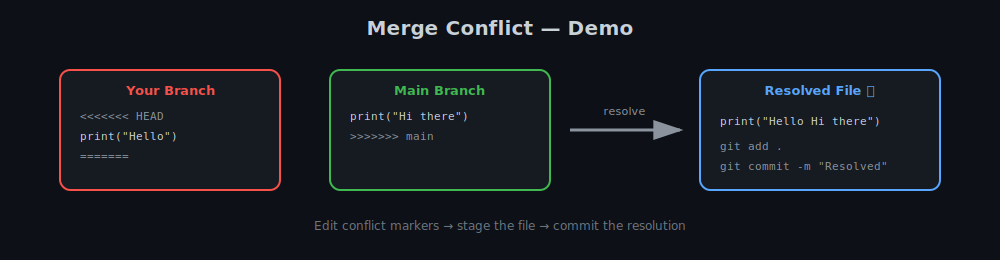
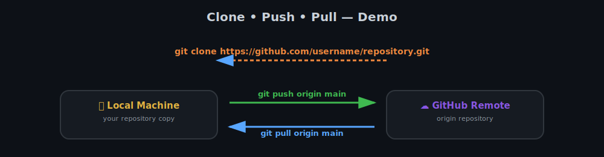

<div align="center">



# 📘 Git & GitHub — Comprehensive Guide


*A detailed academic guide to version control — built for students, beginners, and professionals.*

</div>

---

## 📌 Overview

This repository/document provides a **detailed academic explanation of Git and GitHub**, covering fundamental concepts, commands, workflows, and practical examples. It is designed for students, beginners, and professionals who want a strong foundation in version control systems — especially for **software development, data science, and AI/ML projects**.

---

## 🎯 Learning Objectives

After studying this guide, you will be able to:

- ✅ Understand what Git and GitHub are
- ✅ Differentiate between local and remote repositories
- ✅ Use essential Git commands
- ✅ Manage branches and merges
- ✅ Handle merge conflicts
- ✅ Push and pull code using GitHub
- ✅ Follow a professional Git workflow

---

## 🧠 What is Git?

> **Git** is a **Distributed Version Control System (DVCS)** used to track changes in source code during software development.

### 🔑 Key Features of Git
| Feature | Description |
|---|---|
| 🧵 Line-by-line tracking | Tracks every change made to your files |
| 🕰️ Full history | Maintains a complete project timeline |
| 👥 Multi-developer support | Enables simultaneous collaboration |
| 📡 Offline-first | Works without an internet connection |
| ⚡ Fast & lightweight | Optimized for speed at scale |

### 🧩 Why Git is Important?
- 🚫 Prevents code loss
- 🤝 Enables collaboration
- ⏪ Allows rollback to previous versions
- 🤖 Essential for modern software and AI/ML projects

---

## 🌐 What is GitHub?

> **GitHub** is a cloud-based platform that **hosts Git repositories** and provides collaboration tools.

### 🔑 Key Features of GitHub
- 📦 Remote repository hosting
- 🔀 Collaboration via Pull Requests
- 🐛 Issue tracking
- 👀 Code reviews
- 📄 Project documentation
- 🔄 CI/CD integration

---

## 🔁 Git vs GitHub

<div align="center">

</div>

| Git | GitHub |
|---|---|
| Version control tool | Hosting platform |
| Works locally | Works online |
| Command-line based | Web-based interface |
| Tracks code changes | Manages collaboration |

---

## 🗂️ Git Workflow (Conceptual)

<div align="center">

</div>

**Working Directory → Staging Area → Local Repository → Remote Repository**

| Stage | Explanation |
|---|---|
| 🖊️ Working Directory | Modify files |
| 📥 Staging Area | Prepare files (`git add`) |
| 💾 Local Repository | Save a snapshot (`git commit`) |
| ☁️ Remote Repository | Share code (`git push`) |

---

## ⚙️ Essential Git Commands

### 🔹 Check Git Version
```bash
git --version
```

### 🔹 Initialize a Repository
```bash
git init
```

### 🔹 Check Repository Status
```bash
git status
```

### 🔹 Add Files to Staging Area
```bash
git add filename
git add .
```

### 🔹 Commit Changes
```bash
git commit -m "Initial commit"
```

### 🔹 View Commit History
```bash
git log
```

---

## 🌱 Branching in Git

Branches allow parallel development without affecting the main code.

<div align="center">

</div>

### 🔹 Create a Branch
```bash
git branch feature-branch
```

### 🔹 Switch Branch
```bash
git checkout feature-branch
# or
git switch feature-branch
```

### 🔹 Merge Branch
```bash
git merge feature-branch
```

---

## 🔀 Merge Conflicts

A **merge conflict** occurs when Git cannot automatically combine changes.

<div align="center">

</div>

**Steps to Resolve:**
1. Open the conflicted file
2. Manually edit the conflict markers
3. Add the resolved file
4. Commit the changes

```bash
git add .
git commit -m "Resolved merge conflict"
```

---

## ☁️ Working with GitHub

<div align="center">

</div>

### 🔹 Clone a Repository
```bash
git clone https://github.com/username/repository.git
```

### 🔹 Connect Local Repo to GitHub
```bash
git remote add origin https://github.com/username/repository.git
```

### 🔹 Push Code to GitHub
```bash
git push origin main
```

### 🔹 Pull Latest Changes
```bash
git pull origin main
```

---

## 🍴 Forking a Repository

**Forking** creates a personal copy of someone else's repository.

**Use Cases:**
- 🌍 Open-source contributions
- 🧪 Experimenting without affecting the original code

---

## 🧪 Example Workflow (Academic Project)

```bash
git init
git add .
git commit -m "Project setup"

git branch experiment
git checkout experiment
git add model.py
git commit -m "Added ML model"

git checkout main
git merge experiment
git push origin main
```

---

## 🧑‍💻 Git with VS Code

VS Code provides:
- 🔍 Visual diff
- 🧩 Built-in Git panel
- ✍️ Easy commits & pushes
- 🌳 Branch visualization

---

## 📚 Best Practices

- ✍️ Write meaningful commit messages
- 🔁 Commit frequently
- 🌿 Use branches for features
- ⬇️ Pull before pushing
- 🧠 Resolve conflicts carefully
- 📖 Keep README updated

---

## 🏁 Conclusion

Git and GitHub are core tools for:

- 💻 Software Engineering
- 📊 Data Science
- 🤖 AI/ML Development
- 🌍 Open-source contribution

**Mastering them is essential for academic success and industry readiness.**

---

## 📎 References

- [git-scm.com](https://git-scm.com)
- [docs.github.com](https://docs.github.com)
- *Learning Git: A Hands-On & Visual Guide* by Anna Skoulikari and Helen Scott

---

<div align="center">

### Made with 💙 by [**Sayan**](https://www.linkedin.com/in/sayanpal04?utm_source=share_via&utm_content=profile&utm_medium=member_android)

*AI • Deep Learning • Data Innovation — From India to the AI World! 🚀*

</div>
