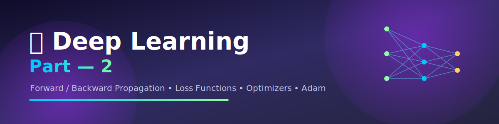

<div align="center">



<br><br>


*A clean, structured digitization of handwritten notes covering the core mathematics and intuition behind training neural networks.*

</div>

---

<div align="center">

🔵⚫🟢⚫🟡⚫🔵⚫🟢⚫🟡⚫🔵⚫🟢⚫🟡⚫🔵⚫🟢⚫🟡⚫🔵

</div>

## 📑 Table of Contents

| # | Topic |
|---|-------|
| 1 | [Forward & Backward Propagation](#1-forward--backward-propagation) |
| 2 | [Loss Functions — Regression](#2-loss-functions--regression) |
| 3 | [Loss Functions — Classification](#3-loss-functions--classification) |
| 4 | [Weight & Bias Updation](#4-weight--bias-updation) |
| 5 | [Chain Rule of Derivatives in NN](#5-chain-rule-of-derivatives-in-nn) |
| 6 | [Vanishing Gradient Problem](#6-vanishing-gradient-problem) |
| 7 | [ReLU & Its Variants](#7-relu--its-variants) |
| 8 | [Batch vs Iteration vs Epoch](#8-batch-vs-iteration-vs-epoch) |
| 9 | [Optimizers](#9-optimizers) |
| 10 | [Modern Variants of Gradient Descent](#10-modern-variants-of-gradient-descent) |

---

## 1. Forward & Backward Propagation

A neural network is trained by moving information in **two directions**:

```
        b
        ↓
x₁ ──w₁──╮
x₂ ──w₂──┼──► Σ ──► f(activation) ──► output
x₃ ──w₃──╯

  ────────────► Forward Propagation
  ◄──────────── Backward Propagation
```

**Backward Propagation** happens in 3 steps:
1. Calculate the **Loss Function**
2. **Update weights** (and biases)
3. Apply an **Optimizer** to make updates efficient

### 🔹 Cost vs Loss

| | Cost | Loss |
|---|---|---|
| **Scope** | Single sample error | Overall error across dataset |
| **Formula** | `½(y − ŷ)²` | `(1/2N) Σ(yᵢ − ŷᵢ)²` |

---

## 2. Loss Functions — Regression

### 🔸 (1) Mean Squared Error (MSE)

```
J(θ) = (1/2N) Σ (yᵢ − ŷᵢ)²
```

| ✅ Pros | ❌ Cons |
|---|---|
| Easily differentiable | Sensitive to outliers |
| Single local/global minima | |

### 🔸 (2) Mean Absolute Error (MAE)

```
J(θ) = (1/N) Σ |yᵢ − ŷᵢ|
```

| ✅ Pros | ❌ Cons |
|---|---|
| Less sensitive to outliers | Not a smooth gradient |

### 🔸 (3) Huber Loss — Best of Both Worlds

> Combines **MSE** (for small errors — quadratic) + **MAE** (for large errors — linear)

```
err = (yᵢ − ŷᵢ)

           ⎧ (1/2N) Σ (yᵢ − ŷᵢ)²         if  err ≤ δ
J(θ) =     ⎨
           ⎩ (δ/N) Σ(|yᵢ−ŷᵢ| − δ/2)      if  err > δ
```

⭐ **Huber Loss performs better on outliers.**

---

## 3. Loss Functions — Classification

Loss Function ⇒ **Cross Entropy**

```
                 ┌── Binary CE (Binary Classification) → Log Loss
Cross Entropy ───┤
                 └── Categorical CE (Multiclass Classification)
```

### 🔸 Binary Classification

```
J(θ) = −(1/N) Σ [ yᵢ log(ŷᵢ) + (1−yᵢ) log(1−ŷᵢ) ]
```

* **Hidden layer** → ReLU
* **Output layer** → Sigmoid → `f(z) = 1 / (1 + e⁻ᶻ)` → range `{0, 1}`

### 🔸 Multiclass Classification

```
J(θ) = − Σ yᵢ log(ŷᵢ)        where c = total classes
```

**Step 1 — One-Hot Encoding**

| f1 | f2 | f3 | O/P | Hot | Cold | Med |
|----|----|----|-----|-----|------|-----|
| | | | Hot | 1 | 0 | 0 |
| | | | Cold | 0 | 1 | 0 |
| | | | Med | 0 | 0 | 1 |

**Step 2 — Apply Softmax Activation**

```
f(zᵢ) = e^zᵢ / Σₖ e^zₖ
```

➡️ Converts raw outputs into **probabilities** that sum to **1**.

Example: `[0.1, 0.7, 0.2] → O/P = Cold`

### 🔸 Summary Table

| | Classification | Regression |
|---|---|---|
| **Binary** | Hidden → ReLU, Output → Sigmoid | Hidden → ReLU, Output → Linear |
| **Multiclass** | Hidden → ReLU, Output → Softmax | — |

---

## 4. Weight & Bias Updation

```
w_new = w_old + η · (∂L / ∂w_old)
b_new = b_old + η · (∂L / ∂b_old)
```

Where **η (eta)** = Learning Rate, and `∂L/∂w` = Slope of the curve.

### 🔹 Case 1 — Positive Gradient
```
w_new = w_old + η(+ve)  ⇒ w_new < w_old   → Left Shift ⬅️
```

### 🔹 Case 2 — Negative Gradient
```
w_new = w_old + η(−ve)  ⇒ w_new > w_old   → Right Shift ➡️
```

📉 Visually, the weight always moves **downhill** toward the minima of the loss curve.

---

## 5. Chain Rule of Derivatives in NN

If `y = f(g(x))` and `g(x) = u`, then `y = f(u)`

```
dy/dx = (dy/du) · (du/dx)     ← Chain Rule
```

### Applying it to a Neural Network

```
x₁ →(w₁)→ [out1] →(w₂)→ [out2 (ŷ)]
```

**Updating w₂:**
```
w₂_new = w₂_old − η · (∂L / ∂w₂_old)

∂L/∂w₂_old = (∂L/∂out2) · (∂out2/∂w₂_old)
```

**Updating w₁ (deeper in the network):**
```
w₁_new = w₁_old − η · (∂L / ∂w₁_old)

∂L/∂w₁_old = (∂L/∂out2) · (∂out2/∂out1) · (∂out1/∂w₁_old)
```

> The deeper the weight, the **longer the chain** of derivatives needed to update it — this is the root cause of the vanishing gradient problem!

---

## 6. Vanishing Gradient Problem

As gradients are multiplied backward through many layers, they can shrink toward **zero**:

```
∂L/∂w1_old = (∂L/∂OP4)·(∂OP4/∂OP3)·(∂OP3/∂OP2)·(∂OP2/∂OP1)·(∂OP1/∂w1_old)

tiny val:        0.03      ×  0.2   ×  0.21  ×  0.1  ×  0.07  ≈ ~0

w1_new = w1_old − η(tiny val)  ⇒  w1_new ≈ w1_old
```

🚨 **Vanishing Gradient Problem** → gradients become vanishingly small, so weights barely change and the network **stops learning**.

### Why does this happen?
When the wrong **activation function** is used — one whose derivative is **less than 1**.

| Activation | Range | Derivative Range |
|---|---|---|
| Sigmoid `f(z) = 1/(1+e⁻ᶻ)` | (0, 1) | **[0, 0.25]** |
| Tanh | (−1, 1) | (1, 1) |

Both squash their derivatives into small ranges → repeated multiplication across layers → gradient vanishes.

---

## 7. ReLU & Its Variants

### ✅ How to Solve Vanishing Gradients?
Apply a better activation function in the **hidden layers**:
→ **ReLU** &nbsp; → **Leaky ReLU**

### 🔹 Rectified Linear Unit (ReLU) — *Simple, Fast, Popular*

```
f(x) = max(0, x)   =   { x   if x ≥ 0
                       { 0   if x < 0

f'(x) =              { 1   if x ≥ 0
                     { 0   if x < 0
```

| ✅ Pro | ❌ Con |
|---|---|
| Solves vanishing gradient problem | **Dying ReLU problem** — neuron gets stuck outputting 0 forever, `w_new = w_old` (no learning) |

### 🔹 Variants to fix Dying ReLU

**1️⃣ Leaky ReLU**
```
f(x) = max(x, 0.01x)      → small fixed slope added for x < 0
```

**2️⃣ Parametric ReLU (PReLU)**
```
f(x) = max(x, αx)         → α is NOT fixed, it's learned
```

**3️⃣ Exponential Linear Unit (ELU)**
```
f(x) = { x            if x ≥ 0
       { α(eˣ − 1)     if x < 0
```

| ✅ Pros of ELU |
|---|
| ① Smooth function → continuous differentiation |
| ② Solves dying ReLU |
| ③ Faster convergence |

---

## 8. Batch vs Iteration vs Epoch

| Term | Meaning |
|---|---|
| **Batch** | A subset of training data |
| **Iteration** | One complete forward + backward pass on **1 batch** |
| **Epoch** | When the neural network sees the **entire training dataset** |

### 📊 Example
```
Dataset size = 1000 images
Batch size   = 100

Batch 1  →  1–100 images
Batch 2  →  101–200 images
   ⋮
Batch 10 →  901–1000 images

Iterations = 1000 / 100 = 10 iterations
1 Epoch    = 10 Iterations
```

---

## 9. Optimizers

> **Optimizers** are algorithms that update weights & biases to **minimize the loss function**.

### 🔹 ① Batch Gradient Descent (BGD)

* Uses the **entire training dataset** per update
* `1 Epoch = 1 Iteration`
* 🐢 Slow &nbsp; | 💾 High Memory &nbsp; | 🎯 Accurate

### 🔹 ② Stochastic Gradient Descent (SGD)

* Uses **one training sample** to update weights
* `1 batch = 1 sample`, `1 Epoch = n Iterations` (n = dataset size)
* ⚡ Fast &nbsp; | 💾 Low Memory &nbsp; | 🌀 Noisy / Unstable

### 🔹 ③ Mini-Batch Gradient Descent

* Uses a **small batch of samples** (16, 32, 64 ...)
* ⚡ Fast &nbsp; | ⚖️ Moderate Memory &nbsp; | ✅ Stable — **Best Balance**

| Optimizer | Speed | Memory | Stability |
|---|---|---|---|
| Batch GD | 🐢 Slow | 🔴 High | 🟢 Very stable |
| SGD | ⚡ Fast | 🟢 Low | 🔴 Noisy |
| Mini-Batch GD | ⚡ Fast | 🟡 Moderate | 🟢 Stable |

---

## 10. Modern Variants of Gradient Descent

### 🔹 ① Gradient Descent with Momentum

Adds a **velocity term** to remember the direction of previous updates:

```
Velocity:  V_t = β·V_(t-1) + (1−β)·(∂L/∂w_(t-1))      [β ≈ 0.9]

Weight:    w_t = w_(t-1) − η·V_t
Bias:      b_t = b_(t-1) − η·V_(t-1)
```

💡 **Why add the velocity term?** → To remember the direction of previous updates, which makes optimization **faster**.

### 🔹 ② RMS Prop (Root Mean Square Propagation)

> Each parameter gets a **different, adaptive learning rate η'**

```
S_t = β·S_(t-1) + (1−β)·(∂L/∂w_(t-1))²      ← moving avg of squared gradients

w_t = w_(t-1) − [η / √(S_t + ε)] · (∂L/∂w_(t-1))
    = w_(t-1) − η'·(∂L/∂w_(t-1))            where  η' = η / √(S_t + ε)
```

| Case | Effect |
|---|---|
| **Steep gradient** | Gradient Descent **Slow** |
| **Flat gradient** | Gradient Descent **Fast** |

> As `param gradient ↑ ⇒ η' ↓`  &nbsp; and &nbsp; `param gradient ↓ ⇒ η' ↑`

### 🔹 ③ Adam (Adaptive Moment Estimation)

> **Combination of** → GD Momentum (Vₜ) **+** RMS Prop (Sₜ)

```
Effective Learning Rate:  η' = η / √(S_t + ε)

Weight Updation:   w_t = w_(t-1) − η'·V_(t-1)
Bias Updation:     b_t = b_(t-1) − η'·V_(t-1)
```

🚀 Adam brings together the **direction-memory of Momentum** and the **adaptive step size of RMS Prop** — making it one of the most widely used optimizers in deep learning today.

---

<div align="center">

## 🎯 Quick Recap

```
Forward Prop → Loss Function → Backward Prop → Weight Update → Optimizer → Repeat
```

</div>

---

<div align="center">

### ⭐ If these notes helped you, consider giving this repo a star!

<br>

<a href="https://www.linkedin.com/in/sayanpal04?utm_source=share_via&utm_content=profile&utm_medium=member_android">
  
</a>

<br><br>

[](https://www.linkedin.com/in/sayanpal04?utm_source=share_via&utm_content=profile&utm_medium=member_android)
[](#-deep-learning--part-2)
[](#-deep-learning--part-2)

<sub>© 2026 Sayan · Click the banner or badge above to connect on LinkedIn</sub>

</div>
