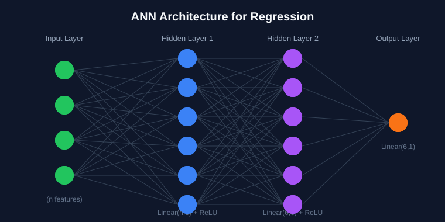

# 🧠 Deep Learning Part - 3: ANN for Regression (PyTorch)

A complete, beginner-friendly guide to building an **Artificial Neural Network (ANN) for Regression** using PyTorch — from raw data to a trained, evaluated model.


---

## 📑 Table of Contents

1. [ANN for Regression](#1-ann-for-regression)
2. [Loading Dataset](#2-loading-dataset)
3. [Tensor Dataset & DataLoader](#3-tensor-dataset--dataloader)
4. [Building the ANN Model](#4-building-the-ann-model)
5. [Training the ANN](#5-training-the-ann)
6. [Saving & Loading the Best Model](#6-saving--loading-the-best-model)
7. [Evaluation](#7-evaluation)
8. [ANN for Classification](#8-ann-for-classification)
9. [Model Evaluation](#9-model-evaluation)

---

## 1. ANN for Regression

### 🪜 Steps Overview

| Step | Action |
|------|--------|
| 1 | Load the data |
| 2 | Convert Data → Tensors |
| 3 | Create Tensor Dataset / DataLoader |
| 4 | Define ANN model |
| 5 | Train the model → Save the model |
| 6 | Evaluate |

> ⚠️ **Important:** Before converting data into tensors, we must first do a **train-test split** and **standardize** the data using `StandardScaler`.

---

## 2. Loading Dataset

Split your dataset into training and testing sets, then scale the features using `StandardScaler` before converting anything into tensors. This ensures the neural network trains on normalized, well-behaved input data.

---

## 3. Converting Data into Tensors

### 🔄 How Datasets are Converted into Tensors?

```python
X_train_tensor = torch.tensor(X_train_scaled, dtype=torch.float32)
y_train_tensor = torch.tensor(y_train.values, dtype=torch.float32).view(-1, 1)
```

### `X_train_tensor`
It is the tensor that stores the **input features** used to train the neural network. Since `X_train_scaled` is already a **2D NumPy array**, it can be converted directly.

### `y_train_tensor`
It stores the **target labels**. First, it needs to be converted from a **Pandas Series** to a **NumPy array** using `.values`.

### 🤔 Why `.view(-1, 1)`?

| Stage | y_train | y_train.values | tensor |
|-------|---------|-----------------|--------|
| Original | Pandas Series (0, 1, 0) | `array([0, 1, 0])` | `tensor([0., 1., 0.])` → shape `torch.Size([3])` (1D) |
| After `.view(-1, 1)` | — | — | `tensor([[0.], [1.], [0.]])` → shape `torch.Size([3, 1])` |

`.view(-1, 1)` reshapes the 1D tensor into a **column vector**, which is the shape PyTorch expects for regression targets.

---

## 4. Tensor Dataset & DataLoader

```
┌─────────────┐      access       ┌──────────────┐
│   System    │ <──────────────── │    Tensor    │
│   Memory    │                   │    Dataset   │
│ [tensor]    │                   └──────┬───────┘
└─────────────┘                          │
                                          ▲
                                  ┌───────┴────────┐
                                  │  DataLoader    │
                                  │     Class      │
                                  └────────────────┘
```

### 📦 Tensor Dataset
Combines one or more tensors into a **single dataset**.

- Can access raw data
- Accesses **one sample/row at a time**
- Used to pair **(features, target)**

```python
from torch.utils.data import TensorDataset

dataset = TensorDataset(X_train_tensor, y_train_tensor)
```

### 🚚 DataLoader
Defines **how the data will be loaded** for training.

- Loads the dataset in **small batches**
- Provides features like **batching** and **shuffling**

```python
from torch.utils.data import DataLoader

loader = DataLoader(dataset, batch_size=2, shuffle=True)
```

---

## 5. Building the ANN Model



### Define ANN Model

```python
class ANN(nn.Module):                          # Creates NN model
    def __init__(self):
        super(ANN, self).__init__()            # Initialize PyTorch NN

        self.model = nn.Sequential(
            # 1st hidden layer
            nn.Linear(X_train.shape[1], 6),     # Take input features, send to 6 neurons
            nn.ReLU(),

            # 2nd hidden layer
            nn.Linear(6, 6),
            nn.ReLU(),

            # Output layer
            nn.Linear(6, 1),
        )

    def forward(self, x):
        return self.model(x)


model = ANN()

criterion = nn.MSELoss()                        # Define MSE Loss function
optimizer = optim.Adam(model.parameters())      # Use Adam optimizer to update
                                                 # model weights and biases
```

#### 🔍 Breakdown

| Component | Purpose |
|-----------|---------|
| `nn.Module` | Base class for all PyTorch neural networks |
| `super().__init__()` | Initializes the parent `nn.Module` class |
| `nn.Sequential` | Stacks layers in order |
| `nn.Linear(in, out)` | Fully connected layer |
| `nn.ReLU()` | Activation function (adds non-linearity) |
| `nn.MSELoss()` | Mean Squared Error — ideal loss function for regression |
| `optim.Adam` | Adaptive optimizer to update weights & biases during training |

---

## 6. Training the ANN

Train the model using the DataLoader batches, computing loss with `criterion`, backpropagating with `.backward()`, and updating weights with `optimizer.step()`.

## 7. Saving & Loading the Best Model

Save the model's `state_dict` whenever validation loss improves, and reload it later using `model.load_state_dict()` for inference or further evaluation.

## 8. Evaluation

Evaluate the trained model on the test set using appropriate regression metrics (e.g., MSE, RMSE, R²).

---

## 9. ANN for Classification & Model Evaluation

*(Continued in the next section of notes — covers building a classification ANN and evaluating it using metrics like accuracy, precision, recall, and confusion matrix.)*

---

## ⭐ Summary Cheat Sheet

```
Load Data → Train-Test Split → Standardize → Convert to Tensors
    → TensorDataset → DataLoader → Define ANN → Train
    → Save Best Model → Evaluate
```

---

<div align="center">

### Made by [Sayan](https://www.linkedin.com/in/sayanpal04?utm_source=share_via&utm_content=profile&utm_medium=member_android)

</div>
