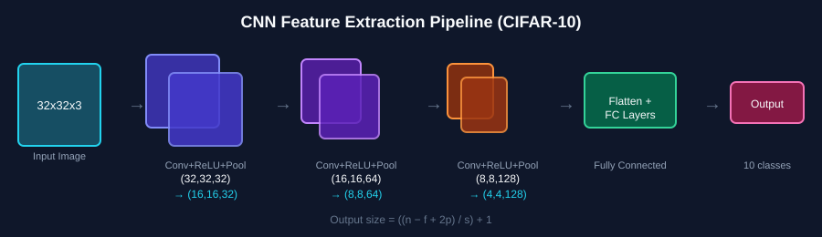
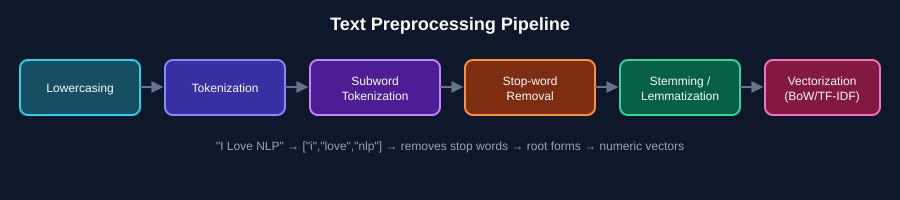
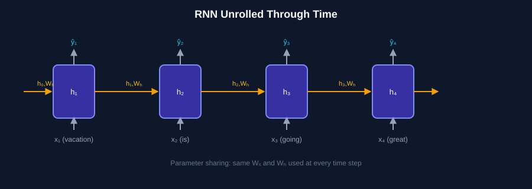
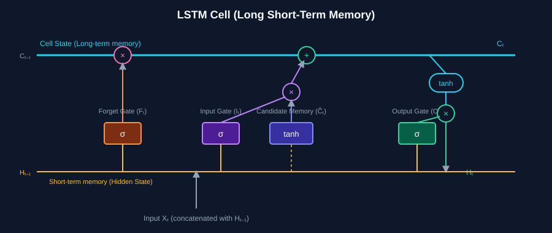

# 🧠 Deep Learning Part - 5: CNN, NLP & Sequence Models

A structured, beginner-friendly guide covering **CNNs for Image Classification**, **Natural Language Processing (NLP)**, **Text Vectorization**, **RNNs**, and **LSTMs** — built from hands-on notes.

---

## 📑 Table of Contents

1. [Mini Project: CNN for Image Classification](#1-cnn-for-image-classification)
2. [Natural Language Processing (NLP)](#2-natural-language-processing-nlp)
3. [Text Processing Techniques](#3-text-processing-techniques)
4. [Vectorization](#4-vectorization)
5. [TF-IDF](#5-tf-idf)
6. [RNN Architecture](#6-rnn-architecture)
7. [Types of RNN Architectures](#7-types-of-rnn-architectures)
8. [Backpropagation in RNN](#8-backpropagation-in-rnn)
9. [LSTM (Long Short-Term Memory)](#9-lstm-long-short-term-memory)

---

## 1. CNN for Image Classification



### 📦 Dataset: CIFAR-10

| Property | Value |
|---|---|
| Total Images | 60,000 |
| Image Size | 32 × 32 (colour) |
| Classes | 10 |
| Images per Class | 6,000 |
| Training Images | 50,000 |
| Testing Images | 10,000 |
| Input Shape | `32 × 32 × 3` |

### 🧮 Output Size Formula (Conv Layer)

```
Output = ((n - f + 2p) / s) + 1
```

| Symbol | Meaning |
|---|---|
| `n` | Input size |
| `f` | Filter/kernel size |
| `p` | Padding |
| `s` | Stride |

**Example:** For `n=32, f=3, p=1, s=1` → `((32-3+2)/1)+1 = 32` → then MaxPool2D halves it → `16 × 16 × 32`

### 🏗️ Feature Map Progression

| Stage | Operation | Output Shape |
|---|---|---|
| Input | — | `(32, 32, 3)` |
| Block 1 | Conv + ReLU → MaxPool | `(32,32,32)` → `(16,16,32)` |
| Block 2 | Conv + ReLU → MaxPool | `(16,16,64)` → `(8,8,64)` |
| Block 3 | Conv + ReLU → MaxPool | `(8,8,128)` → `(4,4,128)` |

### 🔧 Key PyTorch Tools

- `torchvision` → for **Computer Vision** tasks
- Built-in **datasets** → `CIFAR10`, `MNIST`
- **Pretrained CNNs** (transfer learning)
- **Utilities for image transformation**

### 🎚️ Image Preprocessing Scale

```
Images  →  Scale        →  Normalize
(0–255)    (0, 1)           (-1, 1)
```

---

## 2. Natural Language Processing (NLP)

> **NLP deals with text data** — to **understand / generate / interpret / respond** to human language.

NLP sits at the intersection of **GenAI**, **Computer Vision (CV)**, and **NLP** itself as a broader AI field.

### ✨ Common NLP Applications

| # | Task | Example |
|---|---|---|
| 1 | Text Classification | Sports, IT, Political |
| 2 | Sentiment Analysis | Happy, Good, Bad |
| 3 | Text Generation | LLMs |
| 4 | Search Engines | — |
| 5 | Language Translation | English → Bengali |

### 🎯 Task Categories of NLP

```
                Task of NLP
               /            \
   Text Classification    Text Generation
   (e.g. Sentiment          (e.g. Autocomplete,
    Analysis)                Language Translation)
```

---

## 3. Text Processing Techniques



### 1️⃣ Lowercasing
```
"I Love NLP"  →  "i love nlp"
```

### 2️⃣ Tokenization
```
"I Love NLP"  →  ["I", "Love", "NLP"]
```

### 3️⃣ Subword Tokenization
```
unhappiness  →  ["un", "happiness"]
playing      →  ["play", "ing"]
```

### 4️⃣ Stop-word Removal
Removes very common words: `is, the, a, an, and, in, of, to`

```
"I am Learning NLP"  →  ["Learning", "NLP"]
```

### 5️⃣ Stemming
Reduces words to a **root-like form** by chopping prefixes/suffixes (not always a real word).

```
Playing, Played, Plays  →  Play
```

### 6️⃣ Lemmatization
Reduces words to their **proper dictionary base form**.

```
running  →  run
coding   →  code
better   →  good
```

### 7️⃣ Named Entity Recognition (NER)
Identifies and classifies important entities like **PERSON**, **LOCATION**, **ORGANIZATION**.

```
"Sayan studies at KIIT University in BBS"
   ↑ Person        ↑ Organization    ↑ Place
```

### 8️⃣ Vocabulary Building
```
Sentences:
  "I love NLP"
  "I love machine learning"

Vocabulary → ["I", "love", "NLP", "machine", "learning"]

I → 0
love → 1
NLP → 2
machine → 3
learning → 4
```

---

## 4. Vectorization

> Models **can't directly understand text** — it must be converted into numeric vectors.

```
"I Love NLP"  →  [0.2, 0.4, 0.8, ...]
```

### Types of Vectorization

- **BoW** (Bag of Words)
- **TF-IDF**
- **Embedding** (Word2Vec)

### 📊 Bag of Words (BoW) Example

**S1:** I love machine learning
**S2:** I love Deep learning

| | I | Love | machine | Learning | Deep |
|---|---|---|---|---|---|
| S1 | 1 | 1 | 1 | 1 | 0 |
| S2 | 1 | 1 | 0 | 1 | 1 |

```
Vector S1 = [1, 1, 1, 1, 0]
Vector S2 = [1, 1, 0, 1, 1]
```

### 🧬 Word Embedding (Word2Vec)

Captures **semantic relationships** between words:

```
King - Man + Woman = Queen
```

---

## 5. TF-IDF

**TF** = Term Frequency &nbsp;|&nbsp; **IDF** = Inverse Document Frequency

> Determines how important a word is in a document **compared to a collection of documents**.

```
TF  = word count / total number of words

IDF = log( total number of docs / number of docs containing the word )

TF-IDF = TF × IDF
```

| Word Type | IDF Value |
|---|---|
| Rare word | High IDF |
| Common word | Low IDF |

### 📄 Example

```
D1: I love machine learning
D2: I love Deep learning
D3: Machine learning is powerful
```

- `"learning"` → appears in all docs → **common → low IDF**
- `"machine"` → appears in fewer docs → **less common → higher IDF**

---

## 6. RNN Architecture



### 🚫 Why not ANN / CNN for Text?

1. Inputs are treated as **independent**
2. **No memory** of previous inputs

➡️ That's why we use **RNN (Recurrent Neural Network)**.

### 🔁 Key RNN Concepts

- **Parameter Sharing** → the same weights & biases (`Wₓ`, `Wₕ`) are reused at every time step
- **Hidden State (`hₜ`)** → the RNN's *internal memory* — it summarizes and stores information from previous steps

```
h₀ = [0, 0, 0, ...]
Wₕ = weight matrix for hidden state
```

### Example: "vacation is going great"

Each word (`x₁, x₂, x₃, x₄`) is passed sequentially, updating the hidden state (`h₀ → h₁ → h₂ → h₃`) at every step, producing an output (`ŷ`) at each time step.

---

## 7. Types of RNN Architectures

| Architecture | Diagram Pattern | Example Use Case |
|---|---|---|
| **One-to-One** | 1 input → 1 output | Image Classification |
| **One-to-Many** | 1 input → many outputs | Image Captioning, Video/Movie Recommendation |
| **Many-to-One** | many inputs → 1 output | Sentiment Analysis |
| **Many-to-Many** | many inputs → many outputs | POS Tagging, Language Translation |

### Aligned vs Unaligned

| Type | Condition | Example |
|---|---|---|
| **Aligned** | input length = output length | POS Tagging |
| **Unaligned** | input length ≠ output length | Translation: "Hi, there" → "Namaste" |

### 🧮 New Hidden State Formula

```
hₜ = tanh( Xₜ·Wₓ + b + hₜ₋₁·Wₕ )
```

| Term | Meaning |
|---|---|
| `hₜ` | Current state |
| `Xₜ` | Current input |
| `hₜ₋₁` | Previous memory |

### 🏋️ Training an RNN

1. Perform **forward propagation**
2. Calculate the **loss**
3. Perform **backward propagation** to update learnable parameters

---

## 8. Backpropagation in RNN

**Example:** Many-to-One (Sentiment Analysis)

```
ŷ = AF(Wₕ · h₄)   →  ŷ (positive)
```

### Weight Update Rules

```
Wₓ = Wₓ - (∂L/∂Wₓ)   where  ∂L/∂Wₓ = (∂L/∂ŷ) · (∂ŷ/∂hₜ) · (∂hₜ/∂Wₓ)

Wₕ = Wₕ - (∂L/∂Wₕ)   where  ∂L/∂Wₕ = (∂L/∂ŷ) · (∂ŷ/∂Wₕ)
```

### ⚠️ Problem: Vanishing Gradient

Caused by the **tanh activation function** — gradients shrink as they're propagated back through many time steps, making it hard for the network to learn long-range dependencies.

> ✅ **Solution:** Improved RNNs → **LSTM**

---

## 9. LSTM (Long Short-Term Memory)



LSTM maintains **both**:
- 🧠 **Cell State (Cₜ)** → Long-term memory
- ⚡ **Hidden State (Hₜ)** → Short-term memory

### 🚪 The Four Gates

| Gate | Symbol | Role |
|---|---|---|
| **Forget Gate** | `Fₜ = σ(...)` | Decides what to discard from cell state |
| **Input Gate** | `Iₜ = σ(...)` | Decides what new info to store |
| **Candidate Memory** | `C̃ₜ = tanh(...)` | Creates new candidate values |
| **Output Gate** | `Oₜ = σ(...)` | Decides what part of cell state to output |

### ⚙️ Operations on the Forget Gate

```
1. Concatenate  [Xₜ, Hₜ₋₁]
2. Z = [Xₜ, Hₜ₋₁] · Wₓ + b
3. σ(Z) → output (0 to 1)
4. Pointwise multiplication with Cₜ₋₁
```

- `σ` output close to **0** → forget the info
- `σ` output close to **1** → keep the info

---

## ⭐ Summary Cheat Sheet

```
CNN (Images)              NLP Pipeline                   RNN / LSTM (Sequences)
─────────────            ──────────────                 ────────────────────────
Conv → ReLU → Pool   Lowercase → Tokenize → Stopwords    Hidden State → Backprop
   → repeat            → Stem/Lemmatize → Vectorize        → Vanishing Gradient
   → Flatten → FC          (BoW / TF-IDF / Embedding)         → LSTM Gates
```

---

<div align="center">

### Made by [Sayan](https://www.linkedin.com/in/sayanpal04?utm_source=share_via&utm_content=profile&utm_medium=member_android)

</div>
